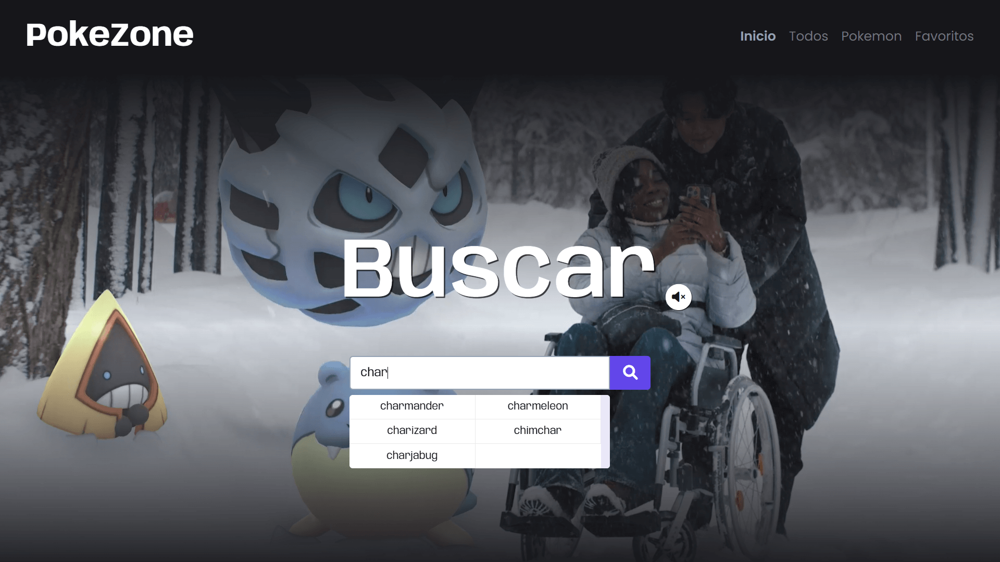
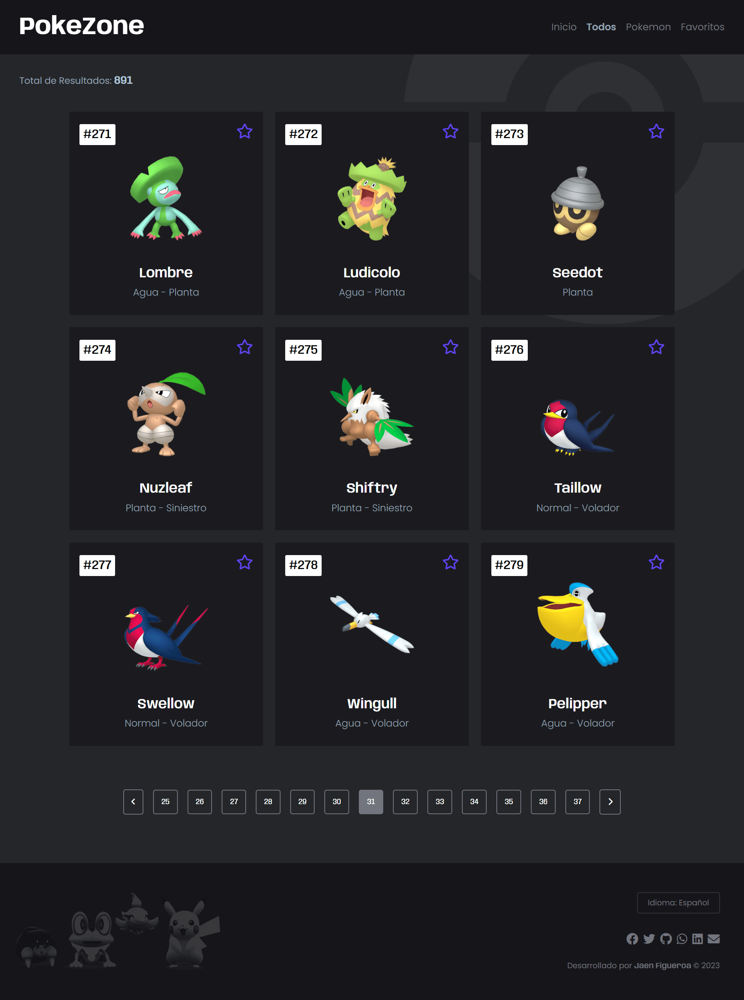
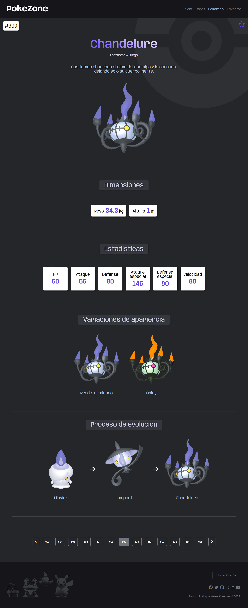

# PokeZone

Este proyecto es una pagina web con temática de Pokémon creado con React.js y la API PokeAPI.

## 📷 Capturas de pantalla

## ⚙ Características 

Los usuarios pueden:

- Buscar un Pokémon por nombre y obtener sugerencias según las coincidencias.
- Navegar en un listado de más de 800 tarjetas de Pokémon, divididas en páginas, cada tarjeta mostrando el nombre, el ID y los tipos del Pokémon.
- Marcar o desmarcar como favoritos una tarjeta haciendo clic en la estrella en la esquina superior derecha.
- Ver información detallada del Pokémon al hacer clic en una tarjeta, dividida en 5 secciones:
  - General: nombre, tipos y una breve descripción.
  - Dimensiones: peso y altura.
  - Estadísticas: HP, ataque, defensa, ataque especial, defensa especial y velocidad.
  - Variaciones de apariencia: predeterminada, femenina, shiny y shiny femenina.
  - Proceso de evolución.
- Acceder a la sección de favoritos, donde se almacenan las tarjetas favoritas marcadas por el usuario, mostrando el nombre, el ID y los tipos, y permitiendo cambiarlos de lugar a gusto del usuario.
- Cambiar el idioma de la aplicación web en cualquier momento desde el pie de página, elegiendo entre 3 idiomas: español, inglés y portugués. El idioma se guardará para la próxima sesión.
<!-- Filtrar los resultados de búsqueda por tipo o región. -->

## 🛠 Tecnologías y marcos de trabajo

- Lenguajes: HTML, CSS, JavaScript
- Bibliotecas y marcos de trabajo: React.js, PokeAPI API
- Fuentes: Source Code Pro
- Colores
  - Primario: #6246ea
  - Secundario: #d1d1e9
  - Blanco: #fffffe
  - Negro1: #010101
  - Negro2: #2b2c34
  - Gris1: #72757e
  - Gris2: #94a1b2

## 📥 Instalación y configuración
Para descargar y probar el proyecto en tu entorno local, sigue estos pasos:

1. Asegúrate de tener instalado Node.js y npm en tu sistema.
2. Descarga o clona el repositorio en tu equipo.
3. En la terminal, accede al directorio del proyecto y ejecuta `npm install`  para instalar todas las dependencias necesarias.
4. Una vez finalizada la instalación, ejecuta `npm start` para arrancar la aplicación.
5. Abre tu navegador en la dirección http://localhost:3000 para acceder a la página.

## 📦 Dependencias

- react
- react-dom
- react-router-dom
- react-spinners
- sortablejs
- i18next

## 🌎 Despliegue en netlify y sitio web

Puedes probar e interactuar con la pagina web [aqui](https://pokezone-jaenfigueroa.netlify.app/).

## 🎓 Nuevos conceptos dominados y aplicados

- Uso de react-router-dom: BrowserRouter, HashRouter, Routes, Route, Navigate, NavLink
- Hooks: useState, useEffect, useParams, useNavigate, useRef, useTranslation
- librerias: sortablejs, i18next

## 💼 Mas proyectos
- Portafolio: www.jaenfigueroa.com

## ☎️ Contacto

- Email: contact@jaenfigueroa.com
- Github: @jaenfigueroa
- Linkedin: @jaenfigueroa
- Whatsapp: +51 995780916

## Licencia Creative Commons

Copyright (c) 2023 Jaen Figueroa

Este trabajo se distribuye bajo la Licencia Creative Commons Attribution 4.0 International (CC BY 4.0). Puedes compartir y usar este trabajo de acuerdo a los términos de la licencia, siempre y cuando se atribuya al autor original. Para ver una copia de la licencia, visita http://creativecommons.org/licenses/by/4.0/.