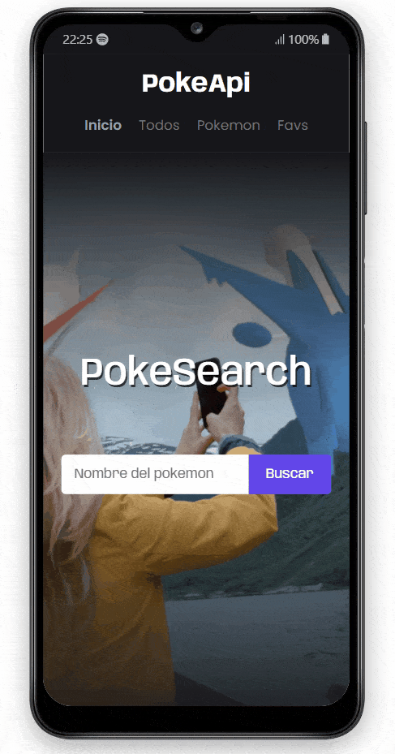

# PokeApi2

## 💡 Brief

In this project, I created a website related to the Pokémon theme using React.js and also the PokeAPI API. I am very satisfied with the results and I am confident that this experience has allowed me to strengthen my knowledge and skills in this technology.

- ### Desktop preview

- ### Mobile preview

## 📌 Users should be able to:

- The user must be able to navigate through the different pages of the website without reloading the browser and correctly use the page layout.
- The user should be able to save their favorites, remove them from the favorites section, and view them in that section, as well as move them around.
- The user should also be able to search by name or ID using a search engine that provides matches based on what they type.

## 🚀 Project was developed with

### 1. Languages

&nbsp;&nbsp;

### 2. Library and Frameworks

### 3. Fonts

- Source Code Pro

### 4. Colors 

- primary: #6246ea;
- secondary: #d1d1e9;
- white: #fffffe;
- black1: #010101;
- black2: #2b2c34;
- gray1: #72757e;
- gray2: #94a1b2; 

## 📖 New Concepts Mastered and Applied

  - Use of react-router-dom: BrowserRouter, HashRouter, Routes, Route, Navigate, NavLink
  - Hooks: useState, useEffect, useParams, useNavigate
  
## 🌍 Deployment on netlify and Website

You can try my final result [here](https://pokeapi-2.netlify.app/).

